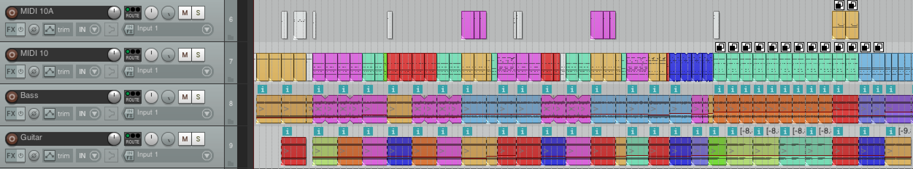

# del2rpp (Deluge to RPP)

Tool for converting [Synthstrom Audible Deluge](https://synthstrom.com/product/deluge/) song files (XML) to [REAPER](https://www.reaper.fm) project files (RPP).



## Limitations

- Currently, only songs written in the arranger mode on the Deluge are converted to REAPER projects; anything not in arranger mode is ignored.
- For audio clip paths to resolve correctly, you should preserve the Deluge's file structure. Don't move your XML out of the `SONGS/` directory -- leave it where it is, and leave the song's audio clips where they are.
- Clips from kits are converted to MIDI notes, with each increasing MIDI pitch representing a row in the kit. This means that you'll have to use a sampler plugin to get your kit sounds to play properly in REAPER.

## Usage
1. Clone or download the repository.

2. Install [pip](https://pip.pypa.io/en/stable/installing/).

3. Install [rpp](https://pypi.org/project/rpp/):
```
pip install rpp
```

4. Run `del2rpp`:
```
python del2rpp.py example/SONGS/Test.XML out.rpp
```

5. Open `out.rpp` with REAPER.

## Issues

del2rpp is early software, and as such it will sometimes break. If you hit any issues, please [submit an issue](https://github.com/dcower/del2rpp/issues/new) and attach the song file that caused the issue.
